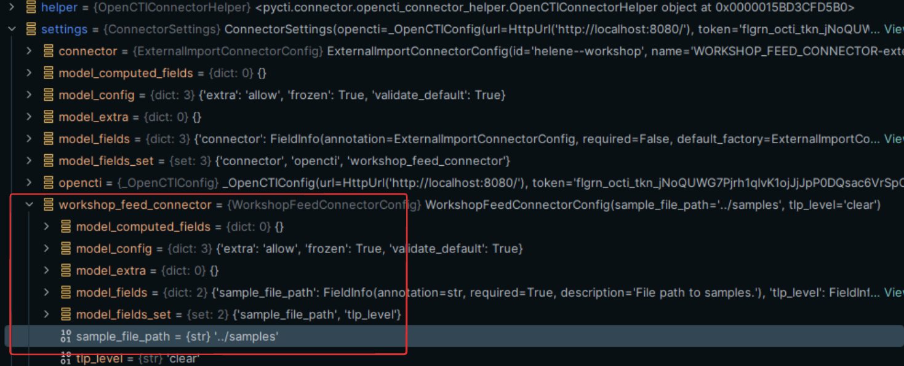

# Module 2 - Deep Dive: Building a Connector

**Time:** 10:40 - 12:30 (lecture ~30 min, lab ~80 min)
**Goal:** understand the connector lifecycle, then build a minimal working connector.

## OpenCTIConnectorHelper

`OpenCTIConnectorHelper` (from `pycti`) is the object that wires your connector to the platform and the message queue. It reads configuration, registers the connector, gives you a logger, and exposes the methods you use to initiate work and send bundles.

You construct it from a config dictionary (typically loaded from `config.yml` and environment variables):

```python
from pycti import OpenCTIConnectorHelper

helper = OpenCTIConnectorHelper(config)
```

The helper handles registration with the platform automatically. What you write is the logic in between.

## Self-triggered vs. platform-triggered

This distinction drives the entire shape of your code.

**Self-triggered (EXTERNAL_IMPORT).** Your connector runs a loop. On each iteration it decides whether enough time has passed (based on its interval and stored state), and if so, it does a run: fetch from the source, build STIX, send it. You drive the schedule.

```python
def run(self):
    self.helper.schedule_iso(
        message_callback=self.process,
        duration_period="PT24H",  # ISO-8601 duration
    )
```

**Platform-triggered (INTERNAL_ENRICHMENT).** Your connector listens. The platform invokes it with a message when a user (or a rule) requests enrichment of a specific entity. You react to that message.

```python
def run(self):
    self.helper.listen(message_callback=self.process_message)
```

In both cases the callback is where your real work happens.

## Work initiation, state, and avoiding duplicates

**Work initiation.** Before sending data, open a "work" so the platform can track the ingestion as a unit and surface progress and errors in the UI:

```python
work_id = self.helper.api.work.initiate_work(
    self.helper.connect_id, "Fetching latest feed"
)
# ... send bundle(s) with this work_id ...
self.helper.api.work.to_processed(work_id, "Done")
```

**State management.** The helper persists a small JSON state for you. Use it to remember where you left off (last run timestamp, last seen cursor) so you only fetch new data:

```python
state = self.helper.get_state() or {}
last_run = state.get("last_run")
# ... do work ...
self.helper.set_state({"last_run": now})
```

**Avoiding duplicates.** Largely free if you do two things: rely on STIX deterministic IDs (don't invent random IDs for the same logical entity), and use state to avoid re-fetching the same window. The workers deduplicate on ID, so a stable ID for "the same thing" means re-sending it updates rather than duplicates.

## Constructing STIX 2.1 bundles and the callback deep dive

Inside your callback:

1. **Fetch / receive.** Pull from the source (import) or read the entity from the message (enrichment).
2. **Build STIX objects.** Use the `stix2` library to create SDOs/SCOs/SROs. Set deterministic IDs, attach the author identity and marking definitions.
3. **Bundle.** Collect objects into a list.
4. **Send.** Serialize and send via the helper:

```python
bundle = self.helper.stix2_create_bundle(stix_objects)
self.helper.send_stix2_bundle(bundle, work_id=work_id)
```

> **On `cleanup_inconsistent_bundle`:** it defaults to `False` because many connectors intentionally ship partial bundles. If you enable it, your bundle must include every referenced object: marking definitions, the author identity, and all base marking options. A `MISSING_REFERENCE_ERROR` usually means a malformed/incomplete bundle, or that the connector lacks rights to create foundational objects, check both.

For enrichment, the callback receives the entity to enrich. You read it, fetch context from your service, build the new objects and relationships, and send them back attached to that entity.

## Hands-on lab

Let's build a minimal working connector together.
We will implement without AI assistance to understand the full workflow and connector lifecycle. Of course, you can use AI to help you create new ones later, but you should understand the underlying concepts first.

### Before you start

Ensure you have completed the prerequisites and pre-check sign-off. You should have a working OpenCTI instance, an API token, and a cloned copy of this repo.

You must be aligned with connectors master branch. If you have a fork, make sure it is up to date:

```bash
# Update your fork and then update local master branch
git pull origin master
```

Create a new branch in your fork of the `connectors` repo. You will be committing your work there.

```bash
git checkout -b <your-branch-name>

# or
git switch -c <your-branch-name>
```

### Step 1: Open the connector repository

You should have cloned the `connectors` repo in the prerequisites. Open it in your code editor.

You will a have all of our connectors listed.

What interest you is the `templates` folder. Inside, you will find a connector template for each type. Open the `EXTERNAL_IMPORT` template.

#### File Descriptions

| File/Directory                       | Purpose                                                   |
| ------------------------------------ | --------------------------------------------------------- |
| `__metadata__/`                      | Contains metadata for connector catalog and documentation |
| `connector_manifest.json`            | Connector information, version, capabilities              |
| `src/connector/connector.py`         | Main connector logic and processing                       |
| `src/connector/converter_to_stix.py` | STIX object creation and conversion                       |
| `src/connector/settings.py`          | Configuration models with Pydantic validation             |
| `src/connector/utils.py`             | Utility functions and helpers                             |
| `src/template_client/api_client.py`        | External API client implementation                        |
| `src/main.py`                        | Entry point, initializes connector                        |
| `tests/`                             | Unit and integration tests                                |
| `config.yml.sample`                  | Sample configuration for users                            |
| `Dockerfile`                         | Container image definition                                |
| `docker-compose.yml`                 | Docker Compose service definition                         |

### Step 2: Create a new connector directory

The fastest way to start is using the provided script in the templates folder. It will copy the template and rename it for you.

```bash
cd templates
sh create_connector_dir.sh -t <TYPE> -n <NAME>
```


It will create a new directory in the `connectors` folder with the name you provided, and copy the template files into it (as it is `EXTERNAL_IMPORT` connector, you should find in the `external-import` folder). You can now open this new directory in your code editor.


It can take few minutes to rename all the files and update the imports. Once done, you can start editing your connector.

If your connector has hyphens in its name, the script will convert them to underscores for the settings.

Please check the config.yml file created to ensure everything is correct.

### Step 4: Install dependencies

Go to your connector directory and install the dependencies in a virtual environment (using pip or uv):

```bash
# Create a virtual environment
python3 -m venv venv
source venv/Scripts/activate

# Check what environment you are using
which python

# Install dependencies
pip install -r requirements.txt
```

### Step 5: Generate an API Token

If you are using your own OpenCTI instance, you can create a new Token and paste it in the `config.yml` file in `token` field.

If you are using the shared lab instance, on OpenCTI:

- Go to Settings > Security > Users and create a new user for your connector and register in `Workshop-Group`.


- Log out and connect with the new user to generate a token in Profile > API Access.
- Copy the token and paste it in the `config.yml` file.

### Step 6: Register the connector in the platform

Go back to your connector directory and edit the `config.yml` file:

- Add your OpenCTI URL (the lab instance URL) and the API token you generated.
- Change the id of the connector to a unique value (e.g. `my-connector-custom`). It will create a unique queue for your connector in RabbitMQ.
- Change the name of the connector in the `config.yml` file to something unique (e.g. `my-connector-custom`).
- Change the scope `vulnerability,ip-addr,software`. The `scope` parameter in OpenCTI connectors defines **what the connector handles**. Its behavior depends on the connector type. **Scope never filters the bundle content.** It only controls **when/how the platform triggers the connector**.
- Change `duration_period` to a longer interval (e.g. `PT10M`) for testing purposes.

You can now run the connector and check that it registers in the platform. You should see it in the connectors list.

```bash
python3 src/main.py

#or using uv
uv run --active src/main.py
```

You will have a bunch of errors in the logs, but the connector should be registered and appear in the platform.

Let's check in the UI in Data > Ingestion > Monitoring.

### Step 7: Implement the connector settings

- Copy paste the `sample` folder in which you will find samples of API responses to use for testing. You will find Domains, IPs, and Vulnerabilities samples. You can use them to test your connector without calling the API.

Once done, let's explore `settings.py`.

<details>
<summary> DETAILS ON SETTINGS </summary>

This defines the configuration schema for an OpenCTI external import connector using the `connectors_sdk` and Pydantic.

**`ExternalImportConnectorConfig`** extends the SDK's base class for `EXTERNAL_IMPORT` connectors. It overrides two fields:

- `name` — the connector's display name, defaulting to `"WorkshopFeedConnectorConnector"`.
- `duration_period` — a `timedelta` controlling how long the connector waits between runs, defaulting to 1 hour. Pydantic parses ISO 8601 duration strings (e.g. `PT2H`) into a `timedelta` here.

**`WorkshopFeedConnectorConfig`** holds the settings specific to this connector's data source:

- `api_base_url` — typed as `HttpUrl`, so Pydantic validates it is a well-formed URL.
- `api_key` — the authentication secret (no default, so it is required).
- `tlp_level` — restricted by `Literal` to the allowed Traffic Light Protocol values, defaulting to `"clear"`. This sets the marking applied to imported entities.

**`ConnectorSettings`** is the top-level config object. It overrides the SDK's `BaseConnectorSettings` to wire in the two config classes above as nested sections:

- `connector` → the generic connector behavior.
- `workshop_feed_connector` → the feed-specific parameters.

Both use `default_factory`, meaning Pydantic instantiates each sub-model automatically, pulling values from the environment (the SDK typically maps `WORKSHOP_FEED_CONNECTOR_API_KEY`, `CONNECTOR_NAME`, etc.). Fields without defaults (like `api_key` and `api_base_url`) must be supplied, or validation fails at startup.

The overall pattern separates SDK-provided defaults from your connector's custom requirements, giving you type-checked, validated configuration loaded from environment variables.

The attributes defined must be written similiarly in the `config.yml` file. If you add a new attribute in the settings, you must add it in the `config.yml` file. As well in the docker-compose.yml file to build the docker image properly.
</details>
</br>

- Where is it instantiated? In `main.py` when the helper is created. The helper reads the config from the environment and validates it against this schema. You can add a debug breakpoint to inspect the object and see the values.

### Step 8: Update settings

- Let's change a configuration parameter in the `config.yml` file and see how it is reflected in the logs when we run the connector.
- Remove `api_base_url` and `api_key` from the `config.yml` file and run the connector. You should see a validation error in the logs.
- Remove from `settings.py` the `api_base_url` and `api_key` attributes and run the connector. You should see a validation error in the logs.

Errors are clear and tell you exactly what is wrong.

- Now remove it completely where it is used: `<template_client>/api_client.py`, `connector/connector.py`, and `docker-compose.yml`.

<details>
<summary> DETAILS ON `api_client.py` </summary>

```python
import requests
from pycti import OpenCTIConnectorHelper
from pydantic import HttpUrl


class WorkshopFeedConnectorClient:
    def __init__(self, helper: OpenCTIConnectorHelper):
        # REMOVED PARAMETERS ==============================
        """
        Initialize the client with necessary configuration.
        For log purpose, the connector's helper CAN be injected.
        Other arguments CAN be added (e.g. `api_key`) if necessary.

        Args:
            helper (OpenCTIConnectorHelper): The helper of the connector. Used for logs.

        =========REMOVED HERE=================

        """
        self.helper = helper

        # REMOVED HERE

    def _request_data(self, api_url: str, params=None):
        """
        Internal method to handle API requests
        :return: Response in JSON format
        """
        try:
            response = self.session.get(api_url, params=params)

            self.helper.connector_logger.info(
                "[API] HTTP Get Request to endpoint", {"url_path": api_url}
            )

            response.raise_for_status()
            return response

        except requests.RequestException as err:
            error_msg = "[API] Error while fetching data: "
            self.helper.connector_logger.error(
                error_msg, {"url_path": {api_url}, "error": {str(err)}}
            )
            return None

    def get_entities(self, params=None) -> dict:
        """
        If params is None, retrieve all CVEs in National Vulnerability Database
        :param params: Optional Params to filter what list to return
        :return: A list of dicts of the complete collection of CVE from NVD
        """
        try:
            # ===========================
            # === Add your code below ===
            # ===========================

            # response = self._request_data() # REMOVED HERE

            # return response.json()
            # ===========================
            # === Add your code above ===
            # ===========================

            raise NotImplementedError

        except Exception as err:
            self.helper.connector_logger.error(err)

```

</details>

<details>
<summary> DETAILS ON `connector.py` </summary>

```python
import sys
from datetime import datetime, timezone

from connector.converter_to_stix import ConverterToStix
from connector.settings import ConnectorSettings
from pycti import OpenCTIConnectorHelper
from workshop_feed_connector_client import WorkshopFeedConnectorClient


class WorkshopFeedConnectorConnector:
    """
    ...
    """

    def __init__(self, config: ConnectorSettings, helper: OpenCTIConnectorHelper):
        """
        ...
        """
        self.config = config
        self.helper = helper

        self.client = WorkshopFeedConnectorClient(
            self.helper,
            # REMOVED HERE =======================================
            # Pass any arguments necessary to the client
        )
        self.converter_to_stix = ConverterToStix(
            self.helper,
            tlp_level=self.config.workshop_feed_connector.tlp_level,
            # Pass any arguments necessary to the converter
        )

    [...]
```

</details>
</br>

- Run the connector, you shouldn't see validation errors in the logs. The connector should register in the platform.

> [!NOTE]
> You will still get an error on the logs because the `get_entities` method is not implemented yet. You will implement it in the next step.

- Let's add a new attribute in the settings. For example, add a new attribute `sample_file_path` in the `WorkshopFeedConnectorConfig` class. Add it in the `config.yml` file and in the `docker-compose.yml` file.

In config.yml:

```yaml
workshop_feed_connector:
  sample_file_path: '../samples' # Add it here
  tlp_level: 'clear' # available values: 'clear', 'white', 'green', 'amber', 'amber+strict', 'red' (default: 'clear')
```

In settings.py:

```python
class WorkshopFeedConnectorConfig(BaseConfigModel):
    """
    Define parameters and/or defaults for the configuration specific to the `WorkshopFeedConnectorConnector`.
    """
    sample_file_path: str = Field(description="File path to samples.")
    tlp_level: Literal[
        "clear",
        "white",
        "green",
        "amber",
        "amber+strict",
        "red",
    ] = Field(
        description="Default TLP level of the imported entities.",
        default="clear",
    )
```

In docker-compose.yml:

```yaml
      - WORKSHOP_CONNECTOR_SAMPLE_FILE_PATH=../samples # Add it here
```

- Add the same breakpoint in the `main.py` file and run the connector. You should see the new attribute in the settings object.



### Step 9: Implement the "client" to fetch data from the source

- We will use our brand new settings attribute `sample_file_path` to read the samples from the `samples` folder.

- Add in `__init__` of `WorkshopFeedConnectorClient` class the following code:

```python
    def __init__(self, helper: OpenCTIConnectorHelper, sample_file_path: str):
        """
        ...
        """
        self.helper = helper

        self.sample_file_path = sample_file_path
        self.domain_path = "/domains_sample.json"
        self.ip_addresses_path = "/ip_addresses_sample.json"
        self.vulnerabilities_path = "/vulnerabilities_sample.json"
```

- Let's basically implement a method to read the samples from the `samples` folder. Add the following code in the `WorkshopFeedConnectorClient` class:

```python
    def _from_json(self, sample_file_path: str) -> dict:
        with open(sample_file_path, "r", encoding="utf-8") as f:
            return json.load(f)
```

- Update `_request_data` method and add for each entity type their own method
  
```python
    def _from_json(self, sample_file_path: str) -> dict:
        with open(sample_file_path, "r", encoding="utf-8") as f:
            return json.load(f)

    def _request_data(self, sample_file_path: str):
        """
        Internal method to handle API requests
        :return: Response in JSON format
        """
        try:
            response = self._from_json(sample_file_path)
            return response

        except requests.RequestException as err:
            error_msg = "[API] Error while fetching data: "
            self.helper.connector_logger.error(
                error_msg, {"url_path": {sample_file_path}, "error": {str(err)}}
            )
            return None

    def get_domain_entities(self) -> dict:
        """
        If params is None, retrieve all CVEs in National Vulnerability Database
        :param params: Optional Params to filter what list to return
        :return: A list of dicts of the complete collection of CVE from NVD
        """
        try:
            # ===========================
            # === Add your code below ===
            # ===========================

            response = self._request_data(self.sample_file_path + self.domain_path)

            return response
            # ===========================
            # === Add your code above ===
            # ===========================

            # raise NotImplementedError

        except Exception as err:
            self.helper.connector_logger.error(err)

    def get_ip_entities(self) -> dict:
        """
        If params is None, retrieve all CVEs in National Vulnerability Database
        :param params: Optional Params to filter what list to return
        :return: A list of dicts of the complete collection of CVE from NVD
        """
        try:
            # ===========================
            # === Add your code below ===
            # ===========================

            response = self._request_data(
                self.sample_file_path + self.ip_addresses_path
            )

            return response
            # ===========================
            # === Add your code above ===
            # ===========================

            # raise NotImplementedError

        except Exception as err:
            self.helper.connector_logger.error(err)

    def get_vulnerability_entities(self) -> dict:
        """
        If params is None, retrieve all CVEs in National Vulnerability Database
        :param params: Optional Params to filter what list to return
        :return: A list of dicts of the complete collection of CVE from NVD
        """
        try:
            # ===========================
            # === Add your code below ===
            # ===========================

            response = self._request_data(
                self.sample_file_path + self.vulnerabilities_path
            )

            return response
            # ===========================
            # === Add your code above ===
            # ===========================

            # raise NotImplementedError

        except Exception as err:
            self.helper.connector_logger.error(err)
```

<details>
<summary> COMPLETE `api_client.py` CODE DETAILS </summary>

```python
import json

import requests
from pycti import OpenCTIConnectorHelper


class WorkshopConnectorClient:
    def __init__(self, helper: OpenCTIConnectorHelper, sample_file_path: str):
        """
        Initialize the client with necessary configuration.
        For log purpose, the connector's helper CAN be injected.
        Other arguments CAN be added (e.g. `api_key`) if necessary.

        Args:
            helper (OpenCTIConnectorHelper): The helper of the connector. Used for logs.
        """
        self.helper = helper

        self.sample_file_path = sample_file_path
        self.domain_path = "/domains_sample.json"
        self.ip_addresses_path = "/ip_addresses_sample.json"
        self.vulnerabilities_path = "/vulnerabilities_sample.json"

    def _from_json(self, sample_file_path: str) -> dict:
        with open(sample_file_path, "r", encoding="utf-8") as f:
            return json.load(f)

    def _request_data(self, sample_file_path: str):
        """
        Internal method to handle API requests
        :return: Response in JSON format
        """
        try:
            response = self._from_json(sample_file_path)
            return response

        except requests.RequestException as err:
            error_msg = "[API] Error while fetching data: "
            self.helper.connector_logger.error(
                error_msg, {"url_path": {sample_file_path}, "error": {str(err)}}
            )
            return None

    def get_domain_entities(self) -> dict:
        """
        If params is None, retrieve all CVEs in National Vulnerability Database
        :param params: Optional Params to filter what list to return
        :return: A list of dicts of the complete collection of CVE from NVD
        """
        try:
            # ===========================
            # === Add your code below ===
            # ===========================

            response = self._request_data(self.sample_file_path + self.domain_path)

            return response
            # ===========================
            # === Add your code above ===
            # ===========================

            # raise NotImplementedError

        except Exception as err:
            self.helper.connector_logger.error(err)

    def get_ip_entities(self) -> dict:
        """
        If params is None, retrieve all CVEs in National Vulnerability Database
        :param params: Optional Params to filter what list to return
        :return: A list of dicts of the complete collection of CVE from NVD
        """
        try:
            # ===========================
            # === Add your code below ===
            # ===========================

            response = self._request_data(
                self.sample_file_path + self.ip_addresses_path
            )

            return response
            # ===========================
            # === Add your code above ===
            # ===========================

            # raise NotImplementedError

        except Exception as err:
            self.helper.connector_logger.error(err)

    def get_vulnerability_entities(self) -> dict:
        """
        If params is None, retrieve all CVEs in National Vulnerability Database
        :param params: Optional Params to filter what list to return
        :return: A list of dicts of the complete collection of CVE from NVD
        """
        try:
            # ===========================
            # === Add your code below ===
            # ===========================

            response = self._request_data(
                self.sample_file_path + self.vulnerabilities_path
            )

            return response
            # ===========================
            # === Add your code above ===
            # ===========================

            # raise NotImplementedError

        except Exception as err:
            self.helper.connector_logger.error(err)

```

</details>
</br>

- Remove unnecessary imports
- As `WorkshopFeedConnectorClient` is instantiated in the `WorkshopFeedConnectorConnector` class, you need to pass the `sample_file_path` attribute from the settings to the client. Update the `__init__` method of the `WorkshopFeedConnectorConnector` class in `connector.py`:

```python
    def __init__(self, config: ConnectorSettings, helper: OpenCTIConnectorHelper):
        """
        ...
        """
        self.config = config
        self.helper = helper

        self.client = WorkshopFeedConnectorClient(
            self.helper,
            self.config.workshop_feed_connector.sample_file_path,
            # Pass any arguments necessary to the client
        )
```

### Step 10: Collect intelligence at regular intervals

Before implementing the intelligence collection, let's check the `run` method in the `WorkshopFeedConnectorConnector` class. It is already implemented to run at regular intervals based on the `duration_period` attribute in the settings.

```python
    def run(self) -> None:
        self.helper.schedule_process(
            message_callback=self.process_message,
            duration_period=self.config.connector.duration_period.total_seconds(),
        )
```

This is an essential part of `EXTERNAL_IMPORT` connectors. And let's details a bit about [Auto backpressure, Scheduling and Execution flow](https://github.com/OpenCTI-Platform/connectors/blob/master/docs/02-external-import-specifications.md#auto-backpressure-scheduling-and-execution)

Implementing it helps to avoid overloading the platform with too many messages at once. The helper will automatically manage the scheduling and execution of the connector's processing logic, ensuring that it runs at the specified intervals without overwhelming the system. And for that, the connector can be in an `idle` state or `buffering` mode or let's say `pause` to let workers consume the messages in the queue. 

When the connector is in a buffering state, it will wait until the platform is ready to accept new messages before proceeding with the next batch of data. This ensures that the connector operates efficiently.


### Step 11: Transform intelligence and convert data to STIX

### Success criteria

- The connector registers and appears in the platform's connectors list.
- It runs without exceptions.
- New entities appear in the platform (import) or new context attaches to the target entity (enrichment).
- You can see the work and its status in the UI.

---

Next: [Module 3 - Best Practices and Code Quality](03-best-practices.md)
