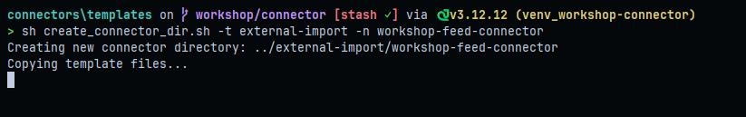
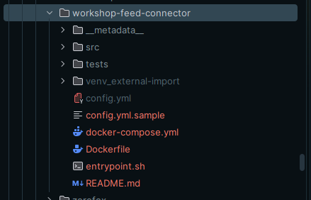
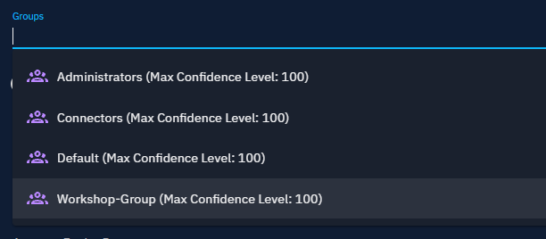

# Module 2 - Deep Dive: Building a Connector

**Time:** 10:40 - 12:30 (lecture ~30 min, lab ~80 min)
**Goal:** understand the connector lifecycle, then build a minimal working connector.

## OpenCTIConnectorHelper

`OpenCTIConnectorHelper` (from `pycti`) is the object that wires your connector to the platform and the message queue. It reads configuration, registers the connector, gives you a logger, and exposes the methods you use to initiate work and send bundles.

You construct it from a config dictionary (typically loaded from `config.yml` and environment variables):

```python
from pycti import OpenCTIConnectorHelper

helper = OpenCTIConnectorHelper(config)
```

The helper handles registration with the platform automatically. What you write is the logic in between.

## Self-triggered vs. platform-triggered

This distinction drives the entire shape of your code.

**Self-triggered (EXTERNAL_IMPORT).** Your connector runs a loop. On each iteration it decides whether enough time has passed (based on its interval and stored state), and if so, it does a run: fetch from the source, build STIX, send it. You drive the schedule.

```python
def run(self):
    self.helper.schedule_iso(
        message_callback=self.process,
        duration_period="PT24H",  # ISO-8601 duration
    )
```

**Platform-triggered (INTERNAL_ENRICHMENT).** Your connector listens. The platform invokes it with a message when a user (or a rule) requests enrichment of a specific entity. You react to that message.

```python
def run(self):
    self.helper.listen(message_callback=self.process_message)
```

In both cases the callback is where your real work happens.

## Work initiation, state, and avoiding duplicates

**Work initiation.** Before sending data, open a "work" so the platform can track the ingestion as a unit and surface progress and errors in the UI:

```python
work_id = self.helper.api.work.initiate_work(
    self.helper.connect_id, "Fetching latest feed"
)
# ... send bundle(s) with this work_id ...
self.helper.api.work.to_processed(work_id, "Done")
```

**State management.** The helper persists a small JSON state for you. Use it to remember where you left off (last run timestamp, last seen cursor) so you only fetch new data:

```python
state = self.helper.get_state() or {}
last_run = state.get("last_run")
# ... do work ...
self.helper.set_state({"last_run": now})
```

**Avoiding duplicates.** Largely free if you do two things: rely on STIX deterministic IDs (don't invent random IDs for the same logical entity), and use state to avoid re-fetching the same window. The workers deduplicate on ID, so a stable ID for "the same thing" means re-sending it updates rather than duplicates.

## Constructing STIX 2.1 bundles and the callback deep dive

Inside your callback:

1. **Fetch / receive.** Pull from the source (import) or read the entity from the message (enrichment).
2. **Build STIX objects.** Use the `stix2` library to create SDOs/SCOs/SROs. Set deterministic IDs, attach the author identity and marking definitions.
3. **Bundle.** Collect objects into a list.
4. **Send.** Serialize and send via the helper:

```python
bundle = self.helper.stix2_create_bundle(stix_objects)
self.helper.send_stix2_bundle(bundle, work_id=work_id)
```

> **On `cleanup_inconsistent_bundle`:** it defaults to `False` because many connectors intentionally ship partial bundles. If you enable it, your bundle must include every referenced object: marking definitions, the author identity, and all base marking options. A `MISSING_REFERENCE_ERROR` usually means a malformed/incomplete bundle, or that the connector lacks rights to create foundational objects, check both.

For enrichment, the callback receives the entity to enrich. You read it, fetch context from your service, build the new objects and relationships, and send them back attached to that entity.

## Hands-on lab

Let's build a minimal working connector.

### Before you start

Ensure you have completed the prerequisites and pre-check sign-off. You should have a working OpenCTI instance, an API token, and a cloned copy of this repo.

You must be aligned with connectors master branch. If you have a fork, make sure it is up to date:

```bash
# Update your fork and then update local master branch
git pull origin master
```

Create a new branch in your fork of the `connectors` repo. You will be committing your work there.

```bash
git checkout -b <your-branch-name>

# or
git switch -c <your-branch-name>
```

### Step 1: Open the connector repository

You should have cloned the `connectors` repo in the prerequisites. Open it in your code editor.

You will a have all of our connectors listed.

What interest you is the `templates` folder. Inside, you will find a connector template for each type. Open the `EXTERNAL_IMPORT` template.

#### File Descriptions

| File/Directory                       | Purpose                                                   |
| ------------------------------------ | --------------------------------------------------------- |
| `__metadata__/`                      | Contains metadata for connector catalog and documentation |
| `connector_manifest.json`            | Connector information, version, capabilities              |
| `src/connector/connector.py`         | Main connector logic and processing                       |
| `src/connector/converter_to_stix.py` | STIX object creation and conversion                       |
| `src/connector/settings.py`          | Configuration models with Pydantic validation             |
| `src/connector/utils.py`             | Utility functions and helpers                             |
| `src/template_client/api_client.py`        | External API client implementation                        |
| `src/main.py`                        | Entry point, initializes connector                        |
| `tests/`                             | Unit and integration tests                                |
| `config.yml.sample`                  | Sample configuration for users                            |
| `Dockerfile`                         | Container image definition                                |
| `docker-compose.yml`                 | Docker Compose service definition                         |

### Step 2: Create a new connector directory

The fastest way to start is using the provided script in the templates folder. It will copy the template and rename it for you.

```bash
cd templates
sh create_connector_dir.sh -t <TYPE> -n <NAME>
```



It will create a new directory in the `connectors` folder with the name you provided, and copy the template files into it (as it is `EXTERNAL_IMPORT` connector, you should find in the `external-import` folder). You can now open this new directory in your code editor.



It can take few minutes to rename all the files and update the imports. Once done, you can start editing your connector.

If your connector has hyphens in its name, the script will convert them to underscores for the settings.

Please check the config.yml file created to ensure everything is correct.

### Step 4: Install dependencies

Go to your connector directory and install the dependencies in a virtual environment (using pip or uv):

```bash
# Create a virtual environment
python3 -m venv venv
source venv/Scripts/activate

# Check what environment you are using
which python

# Install dependencies
pip install -r requirements.txt
```

### Step 5: Generate an API Token

If you are using your own OpenCTI instance, you can create a new Token and paste it in the `config.yml` file in `token` field.

If you are using the shared lab instance, on OpenCTI:

- Go to Settings > Security > Users and create a new user for your connector and register in `Workshop-Group`.



- Log out and connect with the new user to generate a token in Profile > API Access.
- Copy the token and paste it in the `config.yml` file.

### Step 6: Register the connector in the platform

Go back to your connector directory and edit the `config.yml` file:

- Add your OpenCTI URL (the lab instance URL) and the API token you generated.
- Change the id of the connector to a unique value (e.g. `my-connector-custom`). It will create a unique queue for your connector in RabbitMQ.
- Change the name of the connector in the `config.yml` file to something unique (e.g. `my-connector-custom`).
- Change the scope `vulnerability,ip-addr,software`. The `scope` parameter in OpenCTI connectors defines **what the connector handles**. Its behavior depends on the connector type. **Scope never filters the bundle content.** It only controls **when/how the platform triggers the connector**.
- Change `duration_period` to a longer interval (e.g. `PT10M`) for testing purposes.

You can now run the connector and check that it registers in the platform. You should see it in the connectors list.

```bash
python3 src/main.py

#or using uv
uv run --active src/main.py
```

You will have a bunch of errors in the logs, but the connector should be registered and appear in the platform.

Let's check in the UI in Data > Ingestion > Monitoring.

### Step 7: Implement the connector logic

- Copy paste the `sample` folder in which you will find samples of API responses to use for testing. You will find Domains, IPs, and Vulnerabilities samples. You can use them to test your connector without calling the API.

### Success criteria

- The connector registers and appears in the platform's connectors list.
- It runs without exceptions.
- New entities appear in the platform (import) or new context attaches to the target entity (enrichment).
- You can see the work and its status in the UI.

---

Next: [Module 3 - Best Practices and Code Quality](03-best-practices.md)
