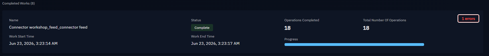
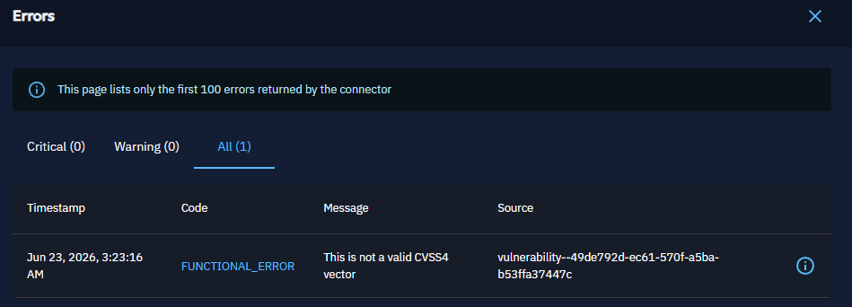
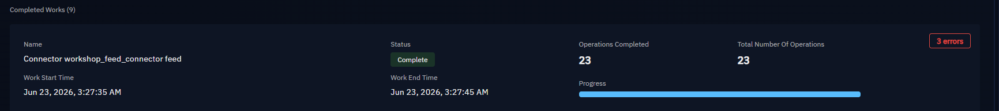
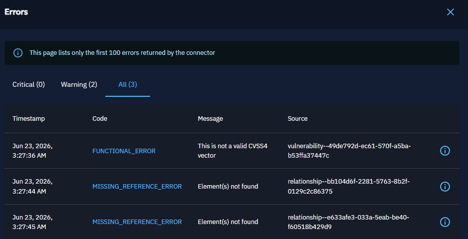

# Module 4 - Testing and Debugging

**Time:** 14:35 - 15:25
**Goal:** be able to run, observe, and debug a connector locally.

## Local testing workflow

The tightest feedback loop is running your connector directly against a running platform, before containerizing.

Watch your connector's own logs first. Most problems show up here before they show up anywhere else: config not loading, auth failing, the source unreachable, or a bundle failing to build.

To run tests, you can use the following commands:

```bash
# Install tests requirements
pip install -r tests/requirements.txt

# or using uv
uv pip install -r tests/test-requirements.txt

# Run tests in the folder
pytest -vv
```

You should see all FAILED tests as ValidationError, which is expected because we removed `api_base_url` and `api_key`.

## Mini lab: Fix the settings tests to pass

- It should be done before this module but for the workshop, we will fix it together. The tests files are in `tests/tests_connector/test_settings.py` and `tests/test_main.py`.

## Inspecting RabbitMQ

RabbitMQ is where you confirm your connector is actually handing off data. If your connector logs "sent bundle" but nothing appears in the platform, the bundle is either stuck in the queue or being rejected by workers.

- Open the RabbitMQ management UI (typically on port 15672).
- Look at queue depth: a growing queue means workers aren't keeping up or are failing.
- A queue that never drains points at a worker problem, not a connector problem.

## Where to look, by symptom

| Symptom | First place to look |
|---------|--------------------|
| Connector doesn't appear in platform | Connector logs, registration/auth |
| Connector registers but does nothing | Your run loop / interval / state |
| "Sent bundle" but no entities | Worker logs, then RabbitMQ queue depth |
| `MISSING_REFERENCE_ERROR` | Bundle completeness, connector rights |
| Duplicates appearing | Non-deterministic IDs in your STIX |
| Runs once then never again | State not updating, or interval logic |

## Common pitfalls walkthrough

- **Non-deterministic IDs.** Generating random IDs for the same logical entity creates duplicates on every run. Let `stix2`/`pycti` derive IDs from defining properties.
- **Forgetting state.** Without state, every run re-fetches and re-imports the whole source. Persist a cursor.
- **Incomplete bundles.** Referencing markings or an author that aren't in the bundle (and aren't yet in the platform). Include them or create them first.
- **Blocking the run loop on errors.** One bad record shouldn't kill the connector. Handle per-item errors and continue.
- **Hardcoded sleeps as synchronization.** Don't sleep-and-hope that ingestion finished. The pipeline is async by design; track work status instead.
- **Swallowed exceptions.** A bare `except` that logs nothing turns a five-minute fix into an afternoon. Log with context.
- **Secrets in logs.** Double-check that error output doesn't echo your token.

## Concrete debugging examples

### Test 1: Invalid CVSS vector

- Remove entities created by your connector from the platform (Observables and Vulnerabilities).
- Change for vulnerabilities sample the CVSS 4 vector string to be invalid, e.g. `CVSS:4.0/AV:N/AC:L/PR:N/UI:N/S:U/C:H/I:H/A:H` → `AV:N/AC:L/PR:N/UI:N/S:U/C:H/I:H/A:X`
- Let's change a bit of the base code to remove relationship creation
- Run the connector and observe the error in the UI. The error message should indicate that the CVSS vector is invalid.




What's happenning here is that the connector is trying to create a Vulnerability with an invalid CVSS vector, which causes the platform to reject the bundle. The error message in the UI indicates that the CVSS vector is invalid, which helps you identify and fix the issue in your connector code.

### Test 2: Missing reference error

- Now, let's remove again the entities created by your connector from the platform (Observables and Vulnerabilities).
- Re-add the relationship creation code in your connector.
- Run the connector and observe the error in the UI. The error message should indicate that there is a missing reference error.




What's happenning here is that the connector is trying to create a relationship between two entities, but one of the entities is missing from the bundle. The error message in the UI indicates that there is a missing reference error, which helps you identify and fix the issue in your connector code.

---

Next: [Module 5 - Contributing and Wrap-up](05-contributing.md)
