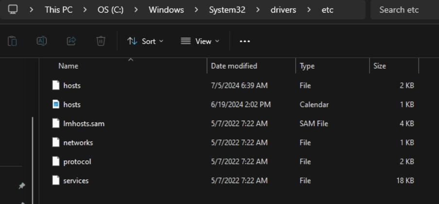
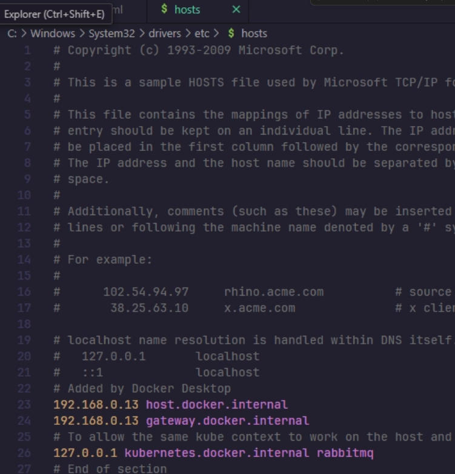

# OpenCTI Lab

OpenCTI lab ready to run in Docker Compose. This is a minimal stack for running the lab exercises, it is not intended for production use.

This instance is for local purposes only, it is not reachable from the internet.

## Lab prerequisites

Having docker installed and running is a prerequisite for the lab. If you are using WSL, make sure to install Docker natively on the WSL side and not via Docker Desktop integration. All commands below assume a WSL/Ubuntu shell.

```bash
# check docker is installed and running
docker --version
cp .env.sample .env # then edit the required variables
docker compose up -d
docker 
```

## Check the platform is healthy

Check connection to the platform with the provided Python script:

```bash
pip install pycti
python check-connection.py
```

Result


## Known issues

Running the connector locally will give you the following error when you connect to the platform because you'll need all the context (RabbitMQ, worker) too.

```
message": "AMQP connection workflow failed: AMQPConnectionWorkflowFailed: 1 exceptions in all; last exception - AMQPConnectorSocketConnectError: TimeoutError(\"TCP connection attempt timed out: 'rabbitmq'/(<AddressFamily.AF_INET: 2>, <SocketKind.SOCK_STREAM: 1>, 6, '', ('172.23.0.5', 5672))\"); first exception - None."}
```

### Solution on Windows OS: Add RabbitMQ service to allow the context

- Go to C:/Windows/System32/drivers/etc
- Open the file `hosts` with a text editor (e.g., Notepad) with admin rights



- Add the following line to the end of the file:
  
  ```txt
  127.0.0.1 rabbitmq
  ```


