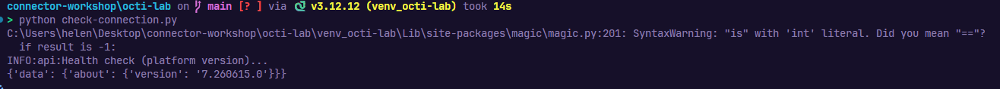

# OpenCTI Lab

OpenCTI lab ready to run in Docker Compose. This is a minimal stack for running the lab exercises, it is not intended for production use.

This instance is for local purposes only, it is not reachable from the internet. 

## Lab prerequisites

Having docker installed and running is a prerequisite for the lab. If you are using WSL, make sure to install Docker natively on the WSL side and not via Docker Desktop integration. All commands below assume a WSL/Ubuntu shell.

```bash
# check docker is installed and running
docker --version
cp .env.sample .env # then edit the required variables
docker compose up -d
docker 
```

## Check the platform is healthy

Check connection to the platform with the provided Python script:

```bash
pip install pycti
python check-connection.py
```

Result

